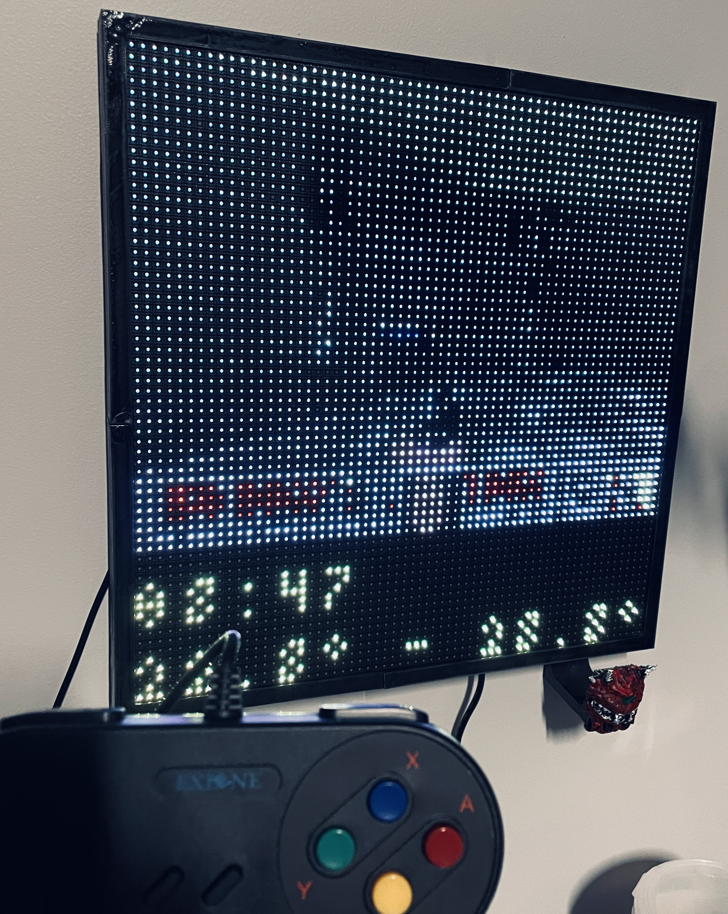

# doom-matrix: picture frame



Runs Doom on LED matrices as wall frame connected to a Raspberry Pi.

## What's in the fork

This is an update to the upstream project with the following additions:
- Preconfigure for double 64x32 screen
- Gamepad support
- Sleep due to gamepad inactivity
- Current time and weather forecast is displayed under the game screen

**Made possible thanks to these libraries:**
- [doomgeneric](https://github.com/ozkl/doomgeneric)
- [rpi-rgb-led-matrix](https://github.com/hzeller/rpi-rgb-led-matrix)
- [SDL2](https://github.com/libsdl-org/SDL) / [SDL_mixer 2](https://github.com/libsdl-org/SDL_mixer)
- [Meteosource](https://github.com/Meteosource/meteosource_cpp)

## Hardware
- [64x32 LED P5 Matrix](https://www.adafruit.com/product/2277) x2
- [Adafruit RGB Matrix Bonnet](https://www.adafruit.com/product/3211)
- [5V 4A Power Supply](https://www.adafruit.com/product/1466)
- Raspberry Pi
- Any USB gamepad
- 3D printer

## Setup tooling and libraries

1. Install C and C++ compilers + `make` for your OS
1. Fetch the dependency submodules with `git submodule update --init --recursive --depth=1`
1. Run `./compile-all.sh`, if it succeeds it will create a binary

### Audio

Audio should be decently turn-key, but can take a little more work. It's not recommended to use the on-board audio on the Pi while driving the matrix for performance reasons, so it's best to disable it on boot. However I used headphone jack on Raspberry Pi 3 without probles.

Because I built the libraries locally I needed to install:
- Sounds
  - `libasound2-dev`
- Music
  - `fluid-soundfont-gm`
  - `freepats`
  - `timidity`
  - `fluidsynth`

And built [SDL](https://github.com/libsdl-org/SDL) and [SDL Mixer](https://github.com/libsdl-org/SDL_mixer) in the `libs/SDL` and `libs/SDL_mixer` paths respectively. [See build and installation instructions](https://wiki.libsdl.org/SDL2/Installation) for more info.

In `libs/SDL` and `libs/SDL_mixer` you should only have to run:
```
./configure
make
make install (as root)
```

**Note:** 
- It can take a while to compile these on a Pi! You can also consider cross-compiling from a faster machine.
- If your distro has SDL packages you can install them instead.
- Even if running `doom-matrix` as `root`, you'll probably need to add your user to the appropriate `audio` group.

## Building the project

`make`

### Cleaning

`make clean`

## Running

The binary accepts arguments for both [rpi-rgb-led-matrix](https://github.com/hzeller/rpi-rgb-led-matrix/tree/master) and [doomgeneric](https://github.com/ozkl/doomgeneric), all the necessary params to run it on a double LED matrix on a Raspberry Pi3 are in script `run.sh`.

If you want for the board to also show temperature forecast from [Meteosource](https://github.com/Meteosource/meteosource_cpp) you need to register on the website (free) and generate an API token and pass it to the run.sh script:

`./run.sh --metsource_key=<my-api-key> --metsource_location=nocatee-7315235 --refresh_weather_timer_sec=3600`

If you don't want the game to play nonstop you can pass the following parameter to pause it if there is no gamepad activity.
It will automatically wake up on any gamepad button click and when weather is refreshed. 

`./run.sh --sleep_timeout_sec=300`
